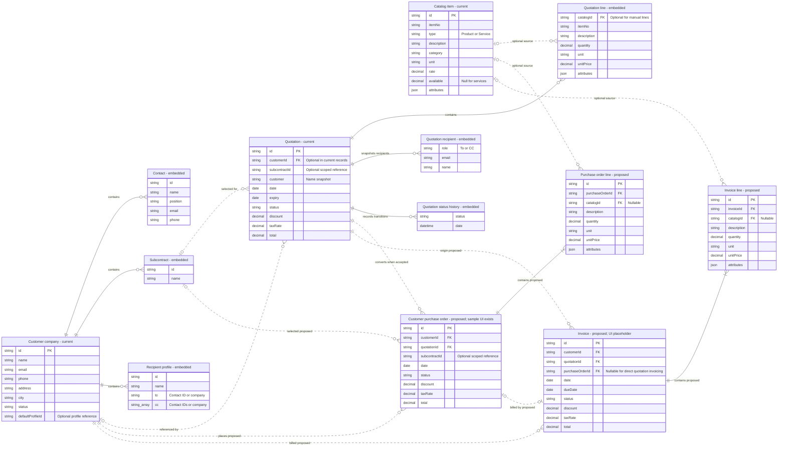
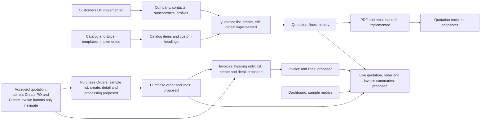

# Sales ER diagram and UI coverage

Based on the repository on 2026-09-16.

This is a **logical model**, not an existing SQL schema. Current data is stored as nested browser-local JSON. “Current” and “embedded” entities reflect implemented TypeScript models; “proposed” entities extend the sample purchase-order list and invoice placeholder. PK/FK markers describe logical identifiers/references, not database-enforced constraints. Embedded children have no independent table or parent FK in the current implementation.

## ER diagram

## UI and data map

UI screens are shown separately because screens are not database entities.

## Implementation coverage

| Area | Current implementation | Proposed completion |
| --- | --- | --- |
| Customers | Company CRUD, contacts, recipient profiles, default profile, subcontracts | Shared database persistence |
| Catalog | Products/services, Excel import/export, configurable extra headings, custom attributes | Shared database persistence |
| Quotations | Create/edit drafts, list/detail, status changes, PDF, external email handoff | Shared database persistence |
| Purchase orders | Searchable static sample list with customer, quotation and invoice references | Conversion from accepted quote; persisted header/lines; create/detail/status UI |
| Invoices | Route and heading; accepted-quote action navigates to it | List/create/detail UI; persisted header/lines; creation from accepted quote or PO |
| Dashboard | Sample metrics and order statuses | Derived summaries from persisted records |

## Scope and assumptions

- **Purchase order means a customer PO in Sales.** Existing samples reference customers and sales quotations, not suppliers. Supplier procurement is a separate, unspecified model and is not silently added.
- PO/invoice fields, line entities and conversion cardinalities are **design proposals**, not implemented requirements. The proposed baseline allows multiple POs per accepted quotation and at most one invoice per PO, matching the sample list's single invoice reference. Direct quotation invoicing is included because the quotation UI already exposes that action. Partial billing would require revising this model.
- Each proposed invoice retains its originating quotation, whether created directly or from a PO. Customer, quotation, PO and subcontract references must agree. Subcontract IDs are scoped to their parent company.
- New saved quotations contain lines, but current demo/type records may omit them; this is why the current quotation-to-line cardinality is zero-to-many. Proposed saved POs and invoices require at least one line.
- Quote customer/subcontract labels, contact details, recipients and line descriptions/prices/attributes are historical snapshots. Do not replace historical values when a company or catalog item changes. The ERD trims some snapshot fields for readability; Quote also stores customerEmail, customerPhone, customerAddress, subcontract, statusDate and isDemo.
- Contact, subcontract and profile IDs are scoped to their company. Embedded line, history and recipient objects have no current IDs. A relational implementation would need parent keys and stable child keys or sequence numbers.
- Recipient profiles use `to` and `cc` references to contact IDs or the special `company` token. They are not contact-only foreign keys. `defaultProfileId` selects a profile within the same company.
- Catalog `name`/`price` duplicate description/rate-facing values in the current model and are omitted from the drawing. Custom template headings are a standalone persisted string array (`goelta.catalog-template.extra-columns.v1`), not a versioned schema entity. Item and quotation-line attributes remain JSON.
- Quotation status: Draft → Sent/Hold; Sent → Accepted/Rejected/Hold; Hold → Draft/Sent. Accepted and Rejected are terminal. Conversion is proposed and must require Accepted.
- Quotations validate stock availability but do not reserve or deduct stock. No inventory movements, payments, suppliers, authentication or delivery entities are implemented or assumed here.
- Proposed document totals should reuse the existing line rounding, discount and tax logic. PO and invoice status workflows remain to be specified.

## Source references

- [Quotation model and sample purchase orders](../Sample%20UI%20sales/src/App.tsx) — Quote type, orders array, Orders and Invoices components, routes and accepted-quote actions.
- [Customers](../Sample%20UI%20sales/src/customers.tsx) — Company, Contact, Profile, Subcontract and recipient selection.
- [Catalog](../Sample%20UI%20sales/src/catalog.tsx) — CatalogItem and browser persistence.
- [Sales logic](../Sample%20UI%20sales/src/sales-logic.ts) — totals, availability and quotation transitions.
- [Persistence](../Sample%20UI%20sales/src/use-persistent-state.ts) — browser storage behavior.
- [Logic audit](../Sample%20UI%20sales/LOGIC-AUDIT.md) — existing implementation boundaries.

